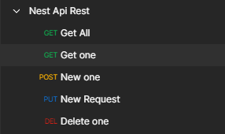

# RepositorioProyecto01

<h2>Documentación REST API NESTJS</h2>

    npm i --save @nestjs/typeorm typeorm mysql @nestjs/swagger swagger-ui-express @types/node

A partir de las historias de usuarios dispuestas en ./historiasUsuario/nestJs.pdf, se ha
creado la siguiente Rest Api con los cinco endpoints más básicos:
 
   - Obtener todos los monumentos.
   - Obtener un monumento. :id
   - Añadir un monumento a la base de datos.
   - Editar un monumento. :id
   - Eliminar un monumento. :id
 
Toda esta documentación se puede consultar en el Swagger (http://localhost:3000/api)
 

 
El sistema gestor de base de datos, al no poder disponer de H2, es MySQL. Su empleo ha sido gracias a
los servicios ofrecidos por XAMPP (MySQL Database, Apache Web Service).
 

 
Desde el panel de control de PHPmyadmin (http://localhost/phpmyadmin/) se puede observar un diseño
de la base de datos junto con la tabla "monumento", donde se encuentran todos sus atributos, siendo el id tipo INTEGER y el resto tipo TEXT. Esta base se puede importar a partir del documento ./monumentos.sql. A parte también se incluyen 3 monumento de ejemplo
 

Para ver como funciona la API, se puede hacer uso de la colección de postman que se adjunta en este mismo repositorio.
Encontraras requests para los cinco endpoints y en la url, se encuentra una variable {{API_BASE_URL}}, definida por
http://localhost:3000.

